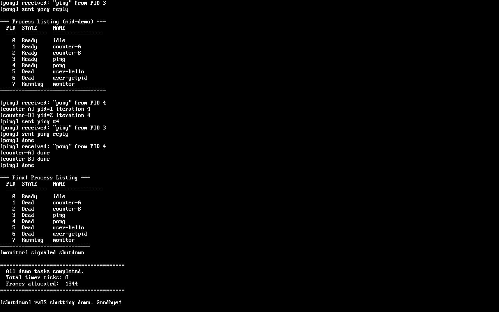

# rvOS

A from-scratch RISC-V 64-bit microkernel operating system written in Rust. Targets `qemu-system-riscv64` (virt machine). Zero external crates — only `core` and `alloc` in the kernel.

## Features

- **Sv39 virtual memory** — 3-level page tables with identity-mapped kernel and per-process user address spaces
- **Preemptive multitasking** — round-robin scheduler driven by timer interrupts, context switch in ~28 instructions
- **User mode** — processes run in U-mode with separate page tables; kernel pages are inaccessible from user code
- **ELF loader** — loads standard RISC-V ELF binaries as user processes
- **Capability-based IPC** — Fuchsia-style bidirectional channels with capability passing; all I/O is channel-based
- **Shared memory** — `SHM_CREATE` / `SHM_DUP_RO` syscalls for zero-copy data sharing between processes
- **Poll-based multiplexing** — `CHAN_POLL_ADD` + `BLOCK` syscalls for select-style I/O on multiple channels
- **Service discovery** — init server acts as a service directory; user processes request services by name and receive channel capabilities
- **mmap/munmap** — user processes can dynamically allocate and free memory pages (or map shared memory regions)
- **Rust std support** — custom `riscv64gc-unknown-rvos` compiler target enables user programs with full Rust `std`
- **Window server** — compositing window server with keyboard/mouse input, multiple client windows on VirtIO GPU
- **Interrupt-driven I/O** — UART, keyboard, mouse, and network input via IRQ with ring buffers and process wake-up
- **UART serial console** — 16550A driver with `print!`/`println!` macros via `core::fmt::Write`
- **VirtIO GPU driver** — MMIO transport, split virtqueue, framebuffer console with 8x16 bitmap font
- **VirtIO keyboard/mouse** — input device drivers with raw event delivery to user-space window server
- **VirtIO network** — Ethernet driver with shared-memory ring buffer; user-space IP/UDP/ARP stack
- **Filesystem** — in-memory tmpfs with directory hierarchy, served over IPC; init loads binaries from `/bin`
- **Process debugger** — attach/detach, single-step, breakpoints, register/memory inspection via debug service
- **Tracing** — `SYS_TRACE` syscall records timestamped events into a kernel ring buffer; viewable from shell
- **Buddy allocator** — physical frame allocator with efficient contiguous allocation for DMA
- **Kernel heap** — 4 MiB buddy allocator with tagged pool accounting (`#[global_allocator]`), enabling `Vec`, `Box`, `String`
- **SpinLock** — atomic spinlock with RAII guard and interrupt disable/restore

## Screenshot

VirtIO GPU framebuffer console showing the full demo (boot, kernel tasks, IPC, user mode, shutdown):



## Quick Start

### Prerequisites

```bash
# Rust nightly with RISC-V target
rustup default nightly
rustup target add riscv64gc-unknown-none-elf
rustup component add rust-src llvm-tools-preview

# QEMU
sudo apt-get install -y qemu-system-misc
```

### Build and Run

```bash
make build    # Build kernel + user programs
make run      # Boot in QEMU (serial on stdio)
```

### Shell Commands

Once booted, an interactive shell appears on the serial console (with line editing, history, tab completion):

```
rvos> help                # List available commands
rvos> echo hi             # Print text
rvos> ps                  # Show process list
rvos> mem                 # Show kernel memory stats
rvos> math add 3 5        # Math service (add/mul/sub)
rvos> ls /bin             # List directory
rvos> cat /etc/motd       # Read file
rvos> write /tmp/f hello  # Write to file
rvos> stat /bin/shell     # Show file metadata
rvos> run /bin/hello      # Run program (& for background, > for redirect)
rvos> trace               # Show/clear trace ring buffer
rvos> clear               # Clear screen
rvos> shutdown            # Shut down the system
```

## Architecture

rvOS follows a **microkernel service model**. Kernel services (console I/O, process info, math, GPU, keyboard, mouse, networking) run as kernel tasks communicating over IPC channels. Higher-level services (filesystem, network stack, window server) run as user processes. All service access is through capability-based channel endpoints obtained via the init server.

### Process List

Serial-only boot (no GPU):

| PID | Name | Type | Role |
|-----|------|------|------|
| 0 | idle | kernel | Idle loop (kmain) |
| 1 | init | kernel | Service directory + process loader |
| 2 | serial-con | kernel | Serial console server |
| 3 | sysinfo | kernel | Process/memory info service |
| 4 | math | kernel | Computation service |
| 5 | proc-debug | kernel | Process debugger service |
| 6 | net-server | kernel | VirtIO network driver service |
| 7 | fs | user | Filesystem server (tmpfs) |
| 8 | shell-serial | user | Interactive shell (serial) |
| 9 | net-stack | user | IP/UDP/ARP network stack |

With GPU, additional kernel tasks are spawned: gpu-server, kbd-server,
mouse-server, fb-con; and user processes: fbcon, window-server, shell-fb.

### IPC Model

```
User Process                     Init Server                 Service
     |                               |                          |
     |-- "stdio" on boot channel --->|                          |
     |                               |-- endpoint via ctrl ch ->|
     |<-- channel cap on boot ch ----|                          |
     |                                                          |
     |============= direct channel ============================|
     |-- write data -->                              <-- read --|
     |<-- input data --                              -- send -->|
```

### Memory Layout (QEMU virt, 128 MiB)

| Range | Contents |
|-------|----------|
| `0x02000000` | CLINT (timer) |
| `0x0C000000` | PLIC (interrupt controller) |
| `0x10000000` | UART 16550A |
| `0x10001000` | VirtIO MMIO devices (8 slots) |
| `0x80000000` | OpenSBI firmware |
| `0x80200000` | Kernel image (text, rodata, data, bss) |
| `_end + 64K` | Boot stack top |
| `_end` ... `0x88000000` | Free physical frames |

### Syscall Interface

| # | Name | Description |
|---|------|-------------|
| 93 | `SYS_EXIT` | Terminate process |
| 124 | `SYS_YIELD` | Yield CPU |
| 172 | `SYS_GETPID` | Get process ID |
| 200 | `SYS_CHAN_CREATE` | Create bidirectional channel pair |
| 201 | `SYS_CHAN_SEND` | Send message on channel (non-blocking) |
| 202 | `SYS_CHAN_RECV` | Non-blocking receive |
| 203 | `SYS_CHAN_CLOSE` | Close channel handle |
| 204 | `SYS_CHAN_RECV_BLOCKING` | Blocking receive |
| 205 | `SYS_SHM_CREATE` | Create shared memory region |
| 206 | `SYS_SHM_DUP_RO` | Duplicate SHM handle as read-only |
| 207 | `SYS_CHAN_SEND_BLOCKING` | Blocking send |
| 208 | `SYS_CHAN_POLL_ADD` | Register channel for poll-based blocking |
| 209 | `SYS_BLOCK` | Block until woken by channel event |
| 215 | `SYS_MUNMAP` | Unmap and free pages |
| 222 | `SYS_MMAP` | Allocate and map pages (or map SHM) |
| 230 | `SYS_TRACE` | Record timestamped trace event |
| 231 | `SYS_SHUTDOWN` | Shut down machine via SBI |
| 232 | `SYS_CLOCK` | Read wall-clock and CPU ticks |
| 233 | `SYS_MEMINFO` | Query physical memory stats |

See [docs/kernel-abi.md](docs/kernel-abi.md) for the full ABI reference.

### User Mode

User processes get their own Sv39 page table:
- Kernel memory mapped without U-bit (inaccessible from user code)
- User code and stack pages mapped with U-bit
- Trap entry switches to kernel page table before accessing kernel stack
- `sret` returns to user code with SPP=0 (U-mode)

### Assembly

Only 4 assembly files (< 400 lines total):
- `boot.S` — set stack, zero BSS, jump to Rust
- `trap.S` — trap entry/exit for both S-mode and U-mode traps
- `switch.S` — context switch + kernel/user task trampolines
- `user_programs.S` — embedded user ELF binaries

Everything else is Rust with inline `asm!` for CSR access, `wfi`, `sfence.vma`, and `ecall`.

## Project Structure

```
rvos/
├── Makefile                     # build, run, run-gui, run-vnc, debug, clean
├── kernel/
│   ├── Cargo.toml
│   ├── linker.ld                # Kernel at 0x80200000
│   └── src/
│       ├── main.rs              # Entry point, boot sequence, service spawning
│       ├── arch/                # boot.S, trap.S, switch.S, trap.rs, paging, CSR
│       ├── mm/                  # Heap, frame allocator, Sv39 page tables
│       ├── task/                # Process model and round-robin scheduler
│       ├── ipc/                 # Bidirectional channel IPC + shared memory
│       ├── services/            # init, console, sysinfo, math, proc-debug, net, GPU/kbd/mouse servers
│       ├── drivers/             # UART, PLIC, TTY, VirtIO (GPU, keyboard, tablet, net)
│       ├── console/             # print! macros, framebuffer text rendering
│       └── sync/                # SpinLock with interrupt save/restore
├── user/
│   ├── shell/                   # Interactive shell (line editing, history, tab completion)
│   ├── fs/                      # Filesystem server (tmpfs, directory hierarchy)
│   ├── net-stack/               # User-space IP/UDP/ARP network stack
│   ├── udp-echo/                # UDP echo server demo
│   ├── window-server/           # Compositing window server (GPU + kbd/mouse)
│   ├── fbcon/                   # Framebuffer console (text terminal on GPU)
│   ├── winclient/               # Window client demo
│   ├── triangle/                # GPU triangle rendering demo
│   ├── dbg/                     # Interactive process debugger client
│   ├── bench/                   # Benchmark suite
│   ├── hello/                   # Hello world with Rust std
│   └── rvos-rt/                 # Runtime crate for std programs
├── lib/
│   ├── rvos/                    # User-space support library (channels, files, I/O)
│   ├── rvos-proto/              # IPC protocol definitions (wire types for all services)
│   ├── rvos-wire/               # Serialization library (no_std)
│   └── rvos-gfx/               # Graphics primitives (Rect, Color, blitting)
├── vendor/
│   ├── rust/                    # Custom Rust compiler (rvOS target + std PAL)
│   ├── qemu/                    # QEMU source (device reference)
│   └── riscv-isa-manual/        # RISC-V ISA specification
└── docs/
    ├── architecture.md          # System architecture deep-dive
    ├── kernel-abi.md            # Syscall and IPC ABI reference
    ├── building.md              # Build system and development guide
    └── protocols/               # IPC protocol specs (net-raw, gpu, kbd, filesystem, ...)
```

## Make Targets

| Target | Description |
|--------|-------------|
| `make build` | Build kernel + all user programs |
| `make run` | Boot in QEMU with serial on stdio |
| `make run-gui` | Boot with VirtIO GPU (requires X/GTK display) |
| `make run-vnc` | Boot with VirtIO GPU on VNC port 5900 |
| `make run-gpu-screenshot` | Headless GPU boot + PPM screenshot |
| `make debug` | QEMU with GDB stub (`-s -S`) |
| `make test` | Run kernel tests via expect scripts |
| `make bench` | Run benchmark suite |
| `make bench-check` | Run benchmarks and check for regressions |
| `make build-std-lib` | Rebuild rvOS std library + clippy (after modifying `lib/` or PAL) |
| `make clippy` | Run clippy on kernel + user crates |
| `make clean` | Remove build artifacts |

## Documentation

- [Architecture Overview](docs/architecture.md) — boot flow, trap handling, context switching, service model
- [Kernel ABI Reference](docs/kernel-abi.md) — syscalls, message format, handle table, boot protocol
- [Building Guide](docs/building.md) — toolchain setup, build system, adding user programs
- [IPC Protocol Specs](docs/protocols/) — wire formats for net-raw, GPU, keyboard, filesystem, and other services

## Design Decisions

- **No external crates** — kernel built on `core` and `alloc` only
- **Identity-mapped kernel** — simplifies early boot and VA↔PA conversion
- **Channel-based I/O** — all user I/O goes through IPC channels (no direct read/write syscalls)
- **Capability passing** — channel endpoints transferred between processes via messages
- **Shared memory for bulk data** — SHM regions for zero-copy transfer (network ring buffers, GPU framebuffers)
- **User-space network stack** — kernel provides raw Ethernet via SHM ring buffer; IP/UDP/ARP runs in user space
- **Buddy allocator** — efficient O(log n) allocation with contiguous frame support for DMA
- **Round-robin scheduling** — timer-driven preemption at ~100ms intervals; cooperative yield also available
- **Custom Rust target** — `riscv64gc-unknown-rvos` enables user programs with full Rust `std` support via a forked Rust toolchain (`vendor/rust/`). The std PAL (`std/src/sys/pal/rvos/`) uses `rvos-wire` and `rvos-proto` (symlinked from `lib/`) for IPC-based I/O. Run `make build-std-lib` after modifying any of these crates

## License

Educational / research use. No license specified.
